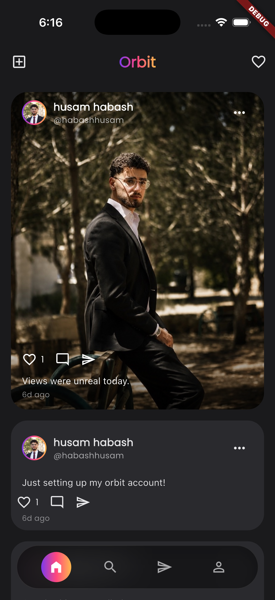
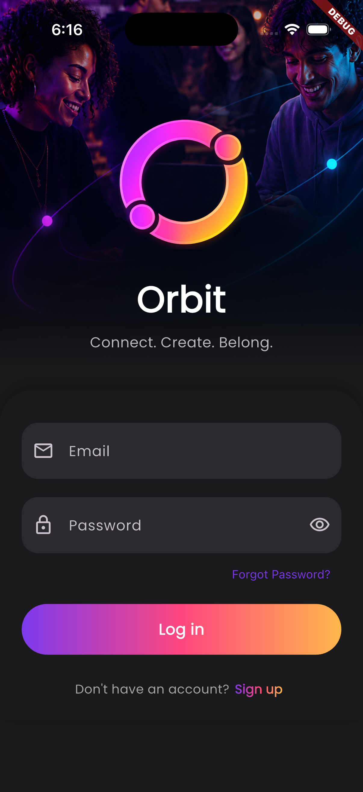
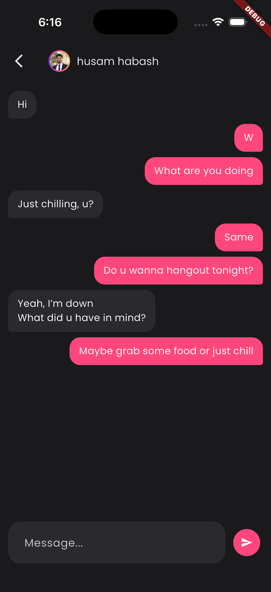

# Orbit

Orbit is a full-stack social media app built with Flutter and Python. It features an Instagram-like feed, real-time 1-on-1 messaging, instant notification pushes, and user profile management.

---

## Screenshots

| Feed & Home | Login & Auth | Real-time Chat |
| :---: | :---: | :---: |
|  |  |  |

---

## How it Works

## Architecture

```text
orbit/
├── backend/
│   ├── api/                    # Main REST API (FastAPI) - Port 8000
│   │   └── grpc_server/        # internal gRPC bridge - Port 5001
│   ├── realtime_chat/          # WebSocket Chat Service - Port 8001
│   └── realtime_notification/  # WebSocket Push Service - Port 8088
│       └── grpc_server/        # internal gRPC listener - Port 8090
└── frontend/                   # Flutter App (iOS, Android, Web)
```

Each backend service is a **separate process** with its own virtual
environment and `requirements.txt` — none of them import from each other at
runtime except by network call (HTTP/gRPC/WebSocket), even though a couple of
modules reach across directories at import time via `sys.path`.

### Why three services instead of one

- **`api`** owns all persisted data (Mongo, via Beanie) and every REST
  endpoint: auth, posts, profiles, follows, search, chat history, and
  notification history.
- **`realtime_chat`** and **`realtime_notification`** are thin, stateful
  WebSocket servers that hold one open connection per online user and push to
  it. They don't touch the database directly — when something needs
  persisting (a chat message, a notification), the WebSocket server calls
  into `api` over gRPC, which does the actual write and then calls back over
  gRPC to push the result live to whoever's connected.

### Data flow example: liking a post

1. Frontend calls `PATCH /post/{id}/like` on the REST API.
2. `PostService.like_post` persists the like and, if it's a new like, calls
   `NotificationService.create_notification`.
3. That saves a `Notification` document, then calls
   `realtime_notification`'s gRPC server (port 8090) with the payload.
4. The gRPC server looks up the recipient's live WebSocket connection (if
   any, in `realtime_notification/connections.py`) and pushes the
   notification down it in real time.
5. The main API's own response to step 1 already returned by now — the
   real-time push is fire-and-forget and never blocks the REST call.

## Tech stack

**Frontend** — Flutter/Dart, Riverpod (state management, clean-architecture
layering: `domain` / `data` / `presentation` per feature), `dio` (REST),
`web_socket_channel` (chat + notifications), Cloudinary (image uploads).

**Backend** — Python, FastAPI, Beanie (MongoDB ODM), PyJWT, grpcio,
`websockets`.

## Prerequisites

- Flutter SDK (3.x+) with an iOS/Android toolchain, or Chrome for web
- Python 3.13
- MongoDB running locally (`mongodb://localhost:27017` by default — see
  `backend/api/db/database.py` to change this)

## Backend setup

Each service needs its own virtual environment. From `backend/`:

```bash
# Main API
cd api
python3 -m venv env
source env/bin/activate
pip install -r requirements.txt
echo -e "secret=<any-random-string>\nalgorithm=HS256" > .env
python main.py         # serves REST on :8000, gRPC chat bridge on :5001
```

```bash
# Chat WebSocket server (separate terminal)
cd backend/realtime_chat
python3 -m venv env
source env/bin/activate
pip install -r requirements.txt
python app.py          # serves WebSocket on :8001
```

```bash
# Notification WebSocket server (separate terminal)
cd backend/realtime_notification
python3 -m venv env
source env/bin/activate
pip install -r requirements.txt
python app.py          # serves WebSocket on :8088, gRPC server on :8090
```

All three need to be running for the full feature set (auth/feed/profile
work off `api` alone; chat and live notification push additionally need
their respective service up).

## Frontend setup

```bash
cd frontend
flutter pub get
flutter run
```

By default the app talks to the backend at `localhost` (Android emulator
uses the standard `10.0.2.2` alias automatically). A physical iOS device
can't reach your Mac via `localhost`, so point it at your Mac's LAN IP
instead of editing source:

```bash
flutter run --dart-define=API_HOST=192.168.1.42   # find yours with `ipconfig getifaddr en0`
```

Camera, photo library, and local-network permission strings are already
configured in `ios/Runner/Info.plist` and
`android/app/src/main/AndroidManifest.xml`.

## Features

- **Auth** — signup/login, JWT sessions, auto-logout on an expired/invalid
  token
- **Feed** — camera-first post creation (capture or pick from gallery),
  caption editing, delete, per-post options menu
- **Profile** — posts grid, full-screen post viewer with Hero transitions,
  followers/following lists, follow/unfollow, message button
- **Search** — debounced user search, suggested users (friends-of-friends)
- **Direct messages** — real-time 1:1 chat over WebSocket, conversation list
  with unread counts, paginated history
- **Notifications** — real-time push (likes, follows) plus paginated history

## Known limitations

- Chat messages have no server-side timestamp field; history timestamps are
  decoded from the message's Mongo ObjectId, and live-received messages just
  use the client's local clock.
- No online-presence indicator in chat, though the server broadcasts one.
- Liking then unliking a post doesn't clean up the "liked your post"
  notification it created — and re-liking creates a duplicate rather than
  reusing it.
- Report post, share post, and saved posts are UI-only placeholders with no
  backend behind them yet.
